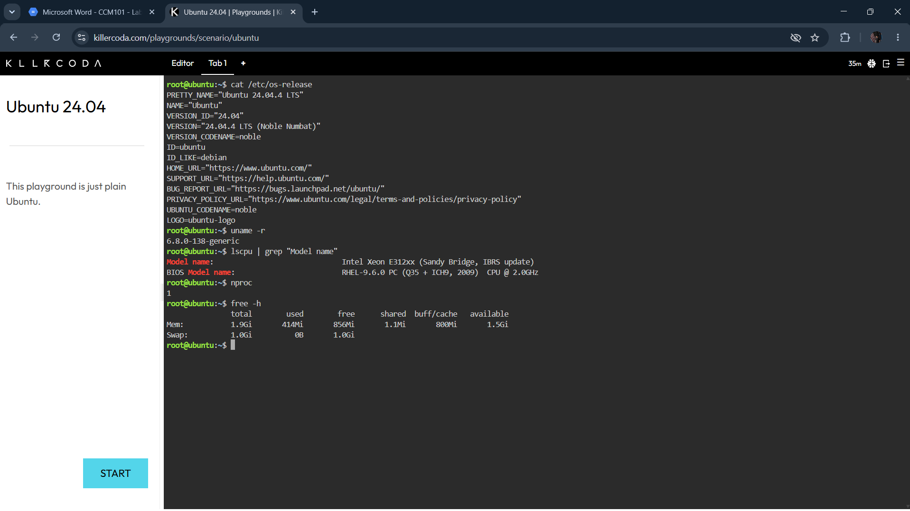
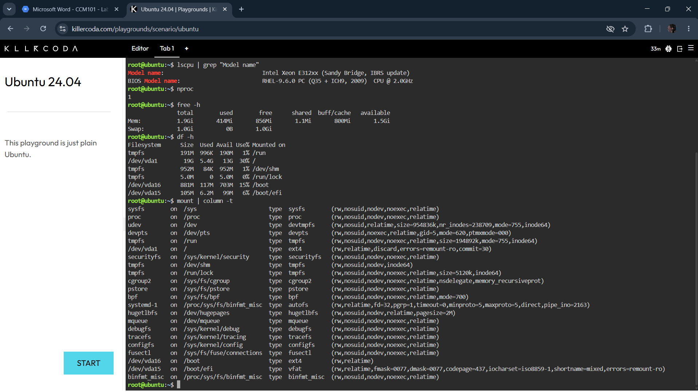
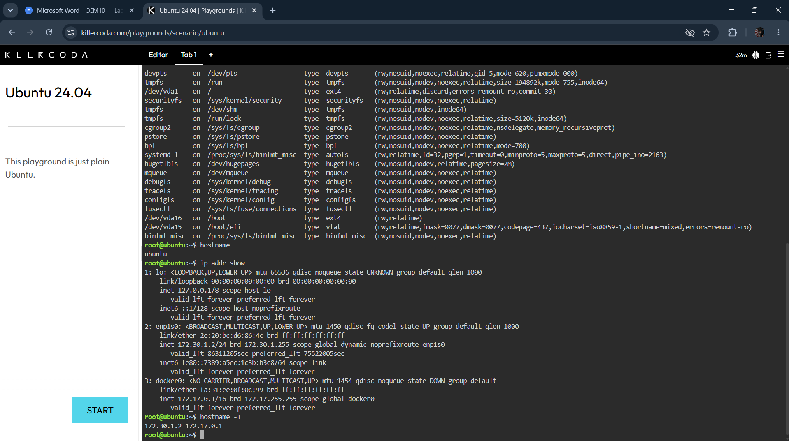

# Infrastructure Report

## Server Environment Summary

| Item | Value |
|---|---|
| Operating System | Ubuntu 24.04.4 LTS (Noble Numbat) |
| Kernel Version | 6.8.0-138-generic |
| CPU Model | Intel Xeon E312xx (Sandy Bridge, IBRS update) |
| CPU Cores | 1 |
| Total RAM | 1.9 GiB (413 MiB used, 857 MiB free, 800 MiB buff/cache, 1.5 GiB available) |
| Disk Capacity | 19 GB on `/` (5.4 GB used, 13 GB available, 30% used) |
| Mounted File Systems | `/` (ext4, 19G), `/boot` (ext4, 881M), `/boot/efi` (vfat, 105M) |
| Hostname | ubuntu |
| IP Address | 172.30.1.2/24 (enp1s0) |

## Investigation Notes
This environment is a lightweight single-core VM with just under 2 GiB of RAM, which is
typical of a sandboxed learning playground rather than a production server — real cloud
compute instances usually offer multiple cores and more memory depending on the workload
tier. The disk is split across three partitions: a small EFI boot partition, a separate
`/boot` partition, and the main root filesystem on `/dev/vda1`. A `docker0` bridge
interface was also present, indicating Docker is installed on the host even though it
wasn't actively used during this investigation. A 1 GiB swap partition is also configured
as a memory overflow buffer, though it was unused (0B) at the time of inspection.

## Screenshots

